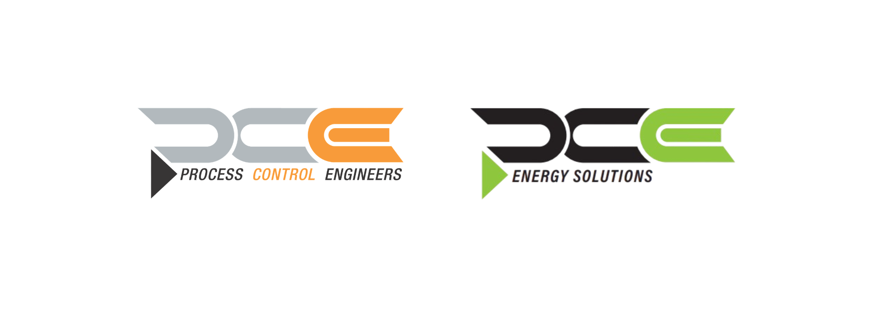

# Process Control Engineers GmbH (PCE)

### Engineering Solutions for Industrial Automation & Process Control

  
  
  

---

### Reliable Engineering. Industrial Excellence.

---

## 🏭 About Us

Process Control Engineers GmbH (PCE) is a Germany-based engineering company specializing in industrial automation, process control, instrumentation, and electrical engineering.

We support industrial clients throughout the complete project lifecycle — from engineering and planning to commissioning, startup, and maintenance support.

---

## ⚙️ Core Services

| Engineering | Industrial Solutions |
|---|---|
| Process Control Engineering | PLC / SPS Programming |
| Electrical Engineering | Automation Systems |
| Functional Safety | SCADA Systems |
| Instrumentation Systems | Plant Commissioning |

---

## 🏗️ Industries We Support

- Oil & Gas  
- Chemical Industry  
- Energy & Utilities  
- Manufacturing  
- Industrial Process Plants  

---

## 🎯 Engineering Principles

- Reliability  
- Safety  
- Efficiency  
- Quality Engineering  
- Practical Industrial Solutions  

---

## 📍 Contact

**Process Control Engineers GmbH**  
Webergasse 18  
85072 Eichstätt  
Germany  

📧 info@pce-ei.de  
🌐 https://www.pce-ei.de/

---

### Process Control Engineers GmbH  
#### Industrial Engineering Solutions

